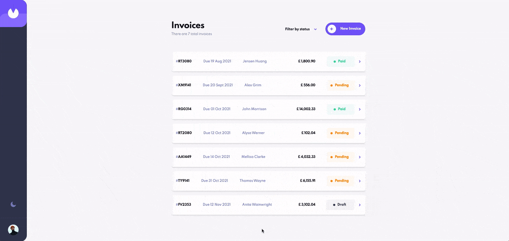
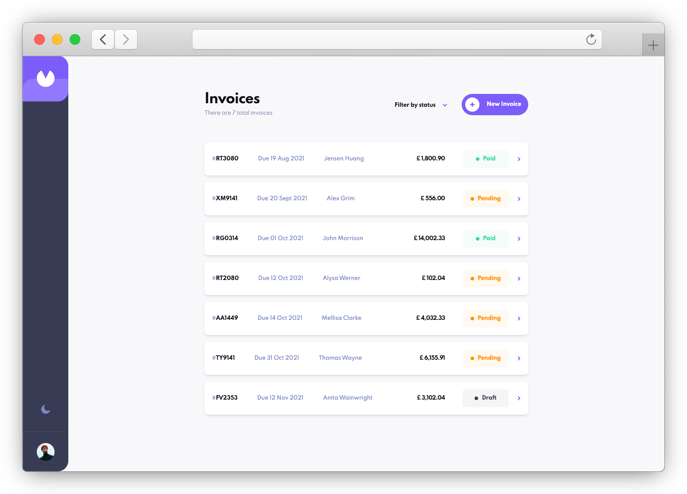
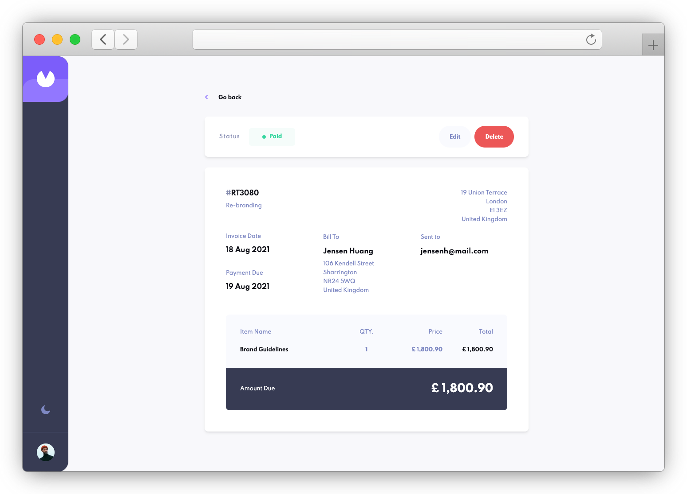
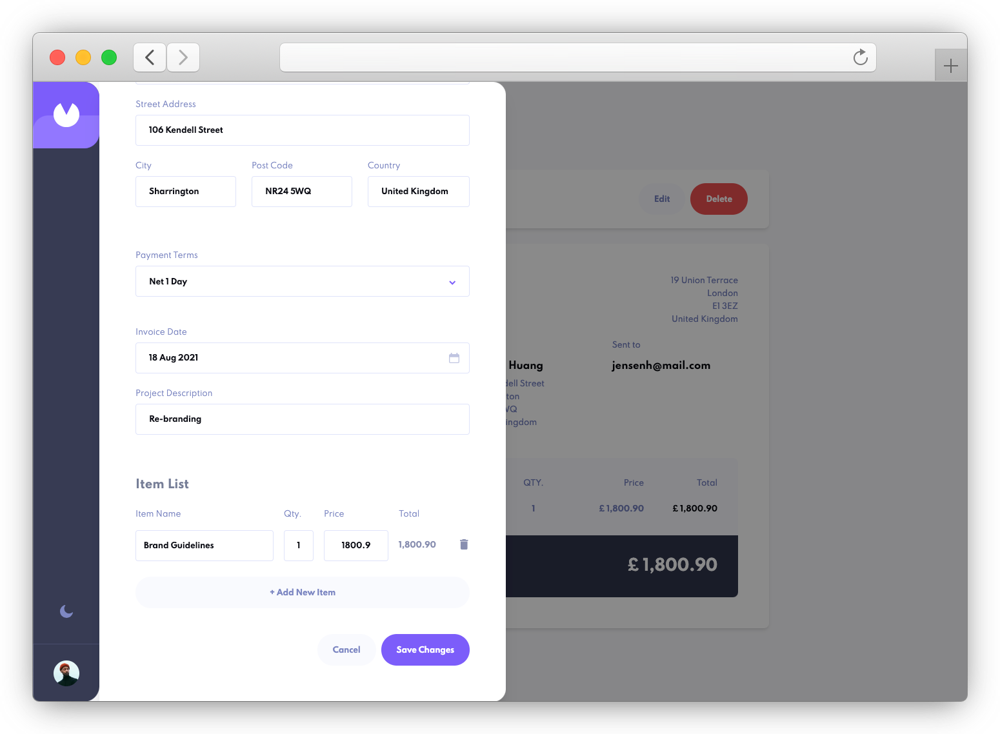
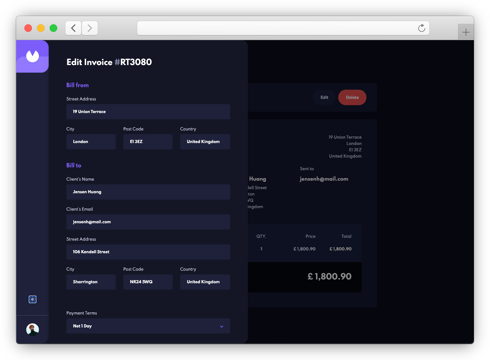

# Invoice App

Invoice App is a web application built using React, Tailwind CSS, React Hook Form, Tanstack Query and json-server to mock a REST API.
This project is created as a practice exercise to improve my skills in React development.

## Demo & Screenshots

### Application Overview

*Quick overview of main functionalities*

### Key Features

#### Invoice List

*Main dashboard with invoice filtering and status management*

#### Invoice Details

*Detailed view with payment status and actions*

#### Edit Invoice

*Intuitive form for editing invoices with item management*

#### Dark Mode

*Dark mode for improved readability*

## Live Version

The application is available online at: https://invoice-app-front-end.vercel.app/

Remember that the initial loading may take more than 30 seconds due to the limitations of the free backend hosting.

**Note:**
Due to the backend being hosted on Render's free plan, the initial loading of the live version may take more than 30 seconds. This is caused by the "spinning down" of inactive services. Subsequent interactions should be much faster. The local version runs without delays.

## Technologies

- **React**: JavaScript library for building user interfaces
- **TailwindCSS**: CSS framework for rapid custom designs
- **react-hook-form**: Library for efficient form management in React
- **Vite**: Build tool for fast frontend application development
- **React Query**: Library for state management and data caching
- **JSON Server**: Lightweight backend for API prototyping and mocking

## Installation

1. Clone the repository:

   git clone https://github.com/RobertGraupner/InvoiceApp.git

2. Navigate to the project directory:

   cd invoice-app

3. Install the dependencies:

   npm install

4. Start the development server:

   npm run dev

## Usage

Access the application at `http://localhost:5173`. The app allows you to:

- View a list of invoices
- Add new invoices
- Add draft invoices
- Edit existing invoices
- Delete invoices
- Filter invoices by status
